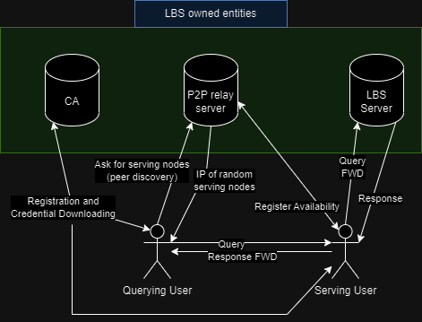
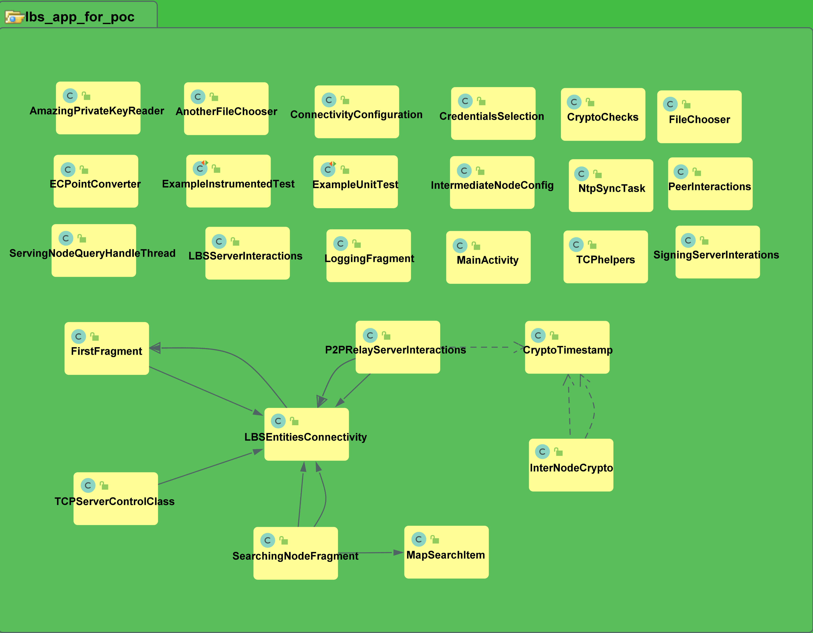

# Secure and Privacy-enhancing Decentralized Location-based Services: LBS user mobile application 

This is the implementation of the mobile application which is run by the users' devices when they
are participating in the LBS scheme which is described in my master's degree thesis: \<DiVA link to be added soon\>

### LBS-owned entities

The implementation of the LBS-owned entities that are employed to realize the privacy-enhancing scheme for these LBS users
can be found [here](https://github.com/MavrosOplarxigos/LBS_entities_for_PoC).

## Abstract of the thesis

Location-based services have seen a growth in popularity in recent decades, which was facilitated by 
the advancements in mobile computing and innovations that allowed for devices to be location-aware. 
Therefore, multiple applications that integrate location information have been developed and made their 
way into the daily lives of the overage mobile device user. To highlight this last point here are some 
such applications; maps and navigation, social-media post geotagging, food delivery, ridesharing, and location-based gaming.

Due to the popularity of location-based services, their providers are handling massive amounts of data
daily from a great number of users. Recent studies have shown these service providers to be honest-but-curious; 
they provide legit information but collect user data which can be used to infer sensitive information. 
The same narrative applies with other types of service providers as well, but in our specific case, 
one other important piece of sensitive information is location; past, current, or future.

Subsequently, many successful privacy-enhancing schemes have been introduced which utilize peer-to-peer 
communication on local ad-hoc wireless networks and attempt to obfuscate the correlation between user 
identity and user location by routing requests amongst users before reaching the provider, replacing 
exact location with fake location, use pseudonyms and information caching to reduce interaction 
with the provider. Such schemes though require a substantial number of users before becoming realizable; 
if users have no peers near them, they cannot join a peer network and thus have to communicate with the provider directly.

In this thesis, a scheme was designed to act as a fallback and predecessor of such wireless peer 
connectivity solutions by utilizing over-the-Internet peer connectivity and leveraging pseudonyms 
to achieve user privacy-enhancement. To test the functionality and fitness of the scheme both a 
mobile application and the orchestration entities were developed. Subsequently, experiments were 
conducted that show that with sharing a small number of peers with a user the peer-hit-ratio metric 
reaches a satisfactory value. The scheme uses mainstream cryptographic standards to allow for 
feature compatibility in future development. In addition, the system was developed to allow for 
many of its parameters to be adjustable in real-time, therefore allowing for future controller software to be integrated with it.

## Over-the-Internet connectivity between the mobile devices

Since in this work, we consider over-the-Internet connectivity between the user and the service itself, 
connectivity between the users during the experiments was happening indeed via TCP/IP albeit in a LAN network.
This implementation though should have no issue working with over-the-Internet connectivity, as well (thus a WAN network), 
as long as the devices are provided with a public IP address which can be shared with the other users that wish to cooperate 
with them.

## Core user-roles developed in the application

Just as the master thesis document describes we have two roles that a user can assume, even at the same time:

1) Querying User: (i.e. the node that wants to search for something using the LBS scheme)
2) Serving User: The proxy (intermediate node) that will interact with the LBS directly and forward back the answer to the searching node.

## Background Processes

The scheme requires for the users to declare their availability to the service as well to retrieve fresh 
serving peer records, periodically. Therefore, from the moment that the application instance joins the scheme 
these routines are initiated and start running in their own respective threads to fulfil these requirements.

## Experiments

This application also includes an implementation of a client that connects to the experiment orchestration server of the service 
which was implemented so that analysis of the scheme, in terms of privacy, was conducted during the thesis project.

## Scheme Architecture

An overview of the LBS scheme architecture can be seen in the image below. Ths mobile application realizes the 
functionality of the users (displayed as stick figures) who join the scheme and cooperate in order to achieve their goal 
of privacy enhancement. We can see how the "Serving User" acts as a proxy between the service and the origin of the request, namely, the
"Querying User".

  

## Mobile Application Architecture/Overview

The UML class diagram (generated using the Code Iris plug-in) below can visualize the dependencies between classes: 

  

The list below briefly describes the purpose and functionality that is implemented by the each class:

- **CredentialsSelection.java**: To allow for the user to select from the filesystem which credentials to use. Eventually, the credentials
were downloaded from the CA every time, but the class remained in the event that in future work the feature of allowing the user to
pick which credentials to use will be restored.
- **CryptoChecks.java**: Includes checks on the parsed certificates and keys to ensure that everything works clockworks (encryption,decryption,signing and signature verification).
- **CryptoTimestamp.java**: Simple class to pack together the bytes of a timestamp with bytes of other included information (such as a cryptographic hash) so as to get a signature on their concatenation.
- **FirstFragment.java**: Handling UI on the initial logging screen of the app, and starting necessary threads after connectivity to the LBS is initiated.
- **InterNodeCrypto.java**: Parsing of received credentials and necessary underlying functionality for secure communication (encryption with peer key, decryption with private key, message timestamp retrieval/signing/freshness/retrieval).
- **LBSEntitiesConnectivity.java**: Stores information about the LBS services, establishes connectivity and displays connectivity status on the logging screen, downloads/stores main and pseudonymous credentials from the LBS service.
- **LBSServerInteractions.java**: Executes a Places API call. This functionality is no longer necessary since the LBS service entities alone communicates with Places API since signing of the responses is a feature that they provide.
- **LoggingFragment.java**: Stores/displays/synchronizes important log messages both for debugging purposes and transparency to the app user.
- **MapSearchItem.java**: Packs into an API call URL all the necessary information of a user query in the format defined by Places API. For this PoC application the entire API call was forwarded as the user query.
- **NtpSyncTask.java**: Asynchronous task for calculating the offset variable between the system timestamp and an NTP server.
- **P2PRelayServerInteractions.java**: Connectivity with the P2P relay server of the LBS for the purpose of peer discovery and disclosure of the availability of the user to serve.
- **PeerInteractions.java**: Storing information for each individual peer connection, implementing the communication protocol to finally retrieve the response to the LBS query as well as run the necessary cryptographic checks, before storing the response in the response aggregation array in its JSON format.
- **SearchingNodeFragment.java**: Manages the fragment which includes the GoogleMap and the other UI components for generating the user query and displaying the LBS response results on the map. Spawns and handles the threads for peer connectivity and aggregates 
responses. Handles experiment synchronization, data collection and related mutual exclusion mechanisms.
- **ServingNodeQueryHandleThread.java**: Implementation of the thread that spawns when another user initiates a query request. This thread follows the designed protocols and carries out this service thus used when the user of the app is "Serving".
- **SigningServerInterations.java**: The interactions between a "Serving" user and the LBS signing server that returns a signed response to the respective query as defined in the scheme's protocols.
- **TCPServerControlClass.java**: Implementation of the "Accepting Thread" which listens for and receives TCP connections on the "Serving Port" of the device. Whenever a connection is received this class spawns a **ServingNodeQueryHandleThread** using the relevant information received from when the connection was received.
- **TCPhelpers.java**: All necessary functionality for the TCP communications the app uses (buffering, data endianness and conversion of data types to byte arrays).